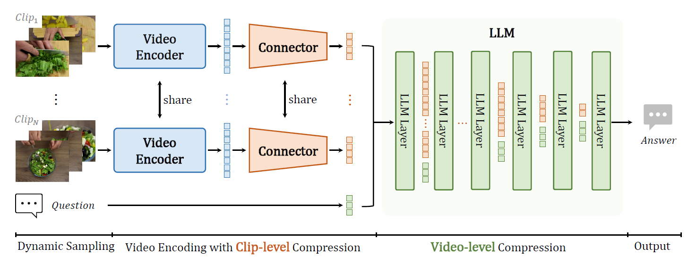

<div align="center">


<h2><a href="https://www.arxiv.org/abs/2501.00574">VideoChat-Flash: Hierarchical Compression for Long-Context Video Modeling</a></h2>

[Xinhao Li](https://scholar.google.com/citations?user=evR3uR0AAAAJ), [Yi Wang](https://scholar.google.com.hk/citations?user=Xm2M8UwAAAAJ), [Jiashuo Yu](https://scholar.google.com.hk/citations?user=iH0Aq0YAAAAJ&oi=ao), Xiangyu Zeng, Yuhan Zhu, Haian Huang, Jianfei Gao, [Kunchang Li](https://scholar.google.com/citations?user=D4tLSbsAAAAJ), [Yinan He](https://dblp.org/pid/93/7763.html), Chenting Wang, [Yu Qiao](https://scholar.google.com/citations?user=gFtI-8QAAAAJ&hl), [Yali Wang](https://scholar.google.com/citations?user=hD948dkAAAAJ), and [Limin Wang](https://scholar.google.com/citations?user=HEuN8PcAAAAJ)

<p align="center">
        🤗 <a href="https://huggingface.co/collections/OpenGVLab/videochat-flash-6781493748713b5ba2b705e0">Model & Data</a> &nbsp&nbsp ｜ &nbsp&nbsp🖥️ <a href="">Demo</a> &nbsp&nbsp | &nbsp&nbsp 📑 <a href="https://www.arxiv.org/abs/2501.00574">Paper</a> &nbsp&nbsp | &nbsp&nbsp 🌐 <a href="https://internvideo.github.io/blog/2024-12-31-VideoChat-Flash/">Blog</a>
<br>

</p>


</div>


## :fire: Updates
- [x] **2025/02/12**: 🎉🎉🎉Our VideoChat-Flash-7B@448 has achieved first place on the latest Video Detail Caption Benchmark, [AuroraCap](https://rese1f.github.io/aurora-web/).
- [x] **2025/01/15**: We provide [evaluation codes](lmms-eval_videochat) for QA & Grounding Benchmark.
- [x] **2025/01/12**: 🔥🔥🔥Release **VideoChat2-Flash**, a powerfull MLLM built on video encoder ([InternVideo](https://github.com/OpenGVLab/InternVideo)) and LLM ([Qwen](https://github.com/QwenLM/Qwen)).
    - We offer five models, [VideoChat2-Flash-2B@224](https://huggingface.co/OpenGVLab/VideoChat-Flash-Qwen2_5-2B_res448) (Small LLM), [VideoChat2-Flash-7B@224](https://huggingface.co/OpenGVLab/VideoChat-Flash-Qwen2-7B_res224), [VideoChat2-Flash-7B@448](https://huggingface.co/OpenGVLab/VideoChat-Flash-Qwen2-7B_res448) (Overall best), [VideoChat-Flash-Qwen2_5-7B-1M](https://huggingface.co/OpenGVLab/VideoChat-Flash-Qwen2_5-7B-1M_res224) (Super long video input) and [VideoChat-Flash-Qwen2_5-7B_InternVideo2-1B](https://huggingface.co/OpenGVLab/VideoChat-Flash-Qwen2_5-7B_InternVideo2-1B) (Stronger short-term temporal understanding).
    <!-- - We provide [online demos]() and demo codes that can be run locally. -->

- [ ] Dataset and training codes.
- [ ] Dataset and evaluation codes for single-hop and multi-hop needle-in-a-haystack;
    <!-- -  We also provide the evaluation codes for various benchmarks, which are constructed based on [lmms-eval](https://github.com/EvolvingLMMs-Lab/lmms-eval). -->


## :parrot: Introduction

**🚀State-of-the-art performance** in short and long video understanding, with temporal localization capabilities comparable to expert models.

**🔭Supports ultra-long video inputs**, achieving a groundbreaking needle-in-a-haystack evaluation accuracy of **99.1% on 10,000 frames**, capable of processing videos up to three hours long.

**⚡Highly efficient model architecture** with exceptional inference speed, encoding each video frame into just **16 tokens**, making it **5–10** times faster than the previous model.



## Demo & Inference


## Evaluation


We modify lmms-eval to eval ..

## Training


### [Instruction Data](./DATA.md)

<!-- We build a diver instruction data with **2M** samples from 34 distince sources. Check [DATA](./DATA.md) for more details. -->


| Stage | Num. frames | ViT | Connector | LLM | Shell |
|--------|:-------:|:------:|:------:|:------:|:------:|
| Stage-1 | 4 | :snowflake: | :fire: | :snowflake: | TBD |
| Stage-2 | 4-8 | :fire: | :fire: | :fire: | TBD |
| Stage-3 | 64-512 | :fire: | :fire: | :fire: | TBD |
| Stage-4 | 64-512 | :fire: | :fire: | :snowflake: | TBD |


## :bar_chart: [NIAH](./BENCHMARK.md)


# :page_facing_up: Citation

If you find this project useful in your research, please consider cite:
```BibTeX
@article{li2024videochat,
  title={VideoChat-Flash: Hierarchical Compression for Long-Context Video Modeling},
  author={Li, Xinhao and Wang, Yi and Yu, Jiashuo and Zeng, Xiangyu and Zhu, Yuhan and Huang, Haian and Gao, Jianfei and Li, Kunchang and He, Yinan and Wang, Chenting and Qiao, Yu and Wang, Yali and Wang, Limin},
  journal={arXiv preprint arXiv:2501.00574},
  year={2024}
}
```

# :dizzy: Acknowledgement

Thanks to the open source of the following projects: [InternVideo](https://github.com/OpenGVLab/InternVideo), [UMT](https://github.com/OpenGVLab/unmasked_teacher), [Qwen](https://github.com/QwenLM/Qwen), [LLaVA-VL](https://github.com/LLaVA-VL/LLaVA-NeXT), [lmms-eval](https://github.com/EvolvingLMMs-Lab/lmms-eval), [Ask-Anything](https://github.com/OpenGVLab/Ask-Anything), [ToMe](https://github.com/facebookresearch/ToMe), [LongVLM](https://github.com/ziplab/LongVLM), [FastV](https://github.com/pkunlp-icler/FastV), [LLaVolta](https://github.com/Beckschen/LLaVolta), [PyramidDrop](https://github.com/Cooperx521/PyramidDrop), [LongVA](https://github.com/EvolvingLMMs-Lab/LongVA), their implementation provides valuable reference experience for our project.
